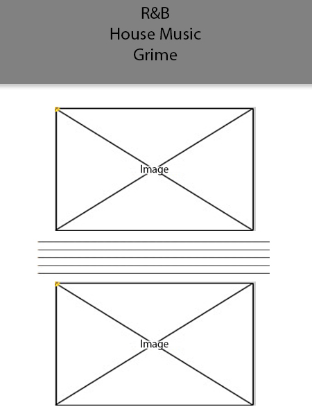

  
This is what the website will look like in desktop view.
  
This is what the website will look like in mobile view.

These are the wireframes I created before designing my website. creating these wireframes allowed me to visualise what iw as going to do and they also made it easier for me to start creating my website. 

I decided to create a website based around music, as it is something that I am very passionate about. This allows me to use prior knowledge I have on music to create a website. 
It also allowed me to picture my designs in my head before creating wirframes which gave me an edge when it come to creating the website. 

I chose to go with a simple dark grey with a light grey as my background, as I believe a simple colour scheme creates a professional looking website. The genres I covered on my website are R&B, House and Grime. These are 
the genres that I like the most and I in my opinion are the genres that are being listened to the most today. 

Reference:

The javascript I used for the slideshow was taken from w3schools:
<a href="https://www.w3schools.com/howto/howto_js_slideshow.asp"> https://www.w3schools.com/howto/howto_js_slideshow.asp </a>